<h1 align="center">Памятка Git Bash</h1>

___

## Оглавление

1. [Навигация](#Навигация).
2. [Работа с файлами](#Работа с файлами).
3. [Репозиторий](#Репозиторий).

___

## Навигация

- pwd - данная команда позволяет узнать в какой директории в текущий момент вы находитесь.
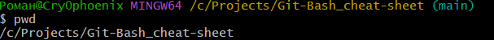
- cd - данная команда позволяет перемещаться из одной папки в другую.
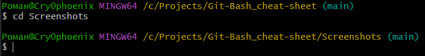
где "Screenshots" это название папки, в которую вам нужно переместиться. Для того, чтобы переместиться на уровень выше вместо названия папки нужно написать две точки:
```
cd ..
```
При написании команды cd можно прописать сразу полный путь до необходимой директории:
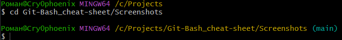
Так же команду cd можно использовать с символом тильда "~", для возвращения в домашнюю директорию.

Чтобы не вводить названия файлов и папок полностью, можно начать вводить их имя и нажать клавишу Tab. Командная строка допишет путь сама, если соответствующий файл или папка есть в текущей директории.
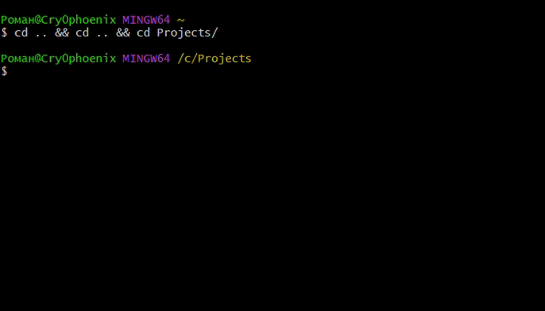

---

## Работа с файлами

- ls - показывает файлы в папке, в который вы сейчас находитесь.
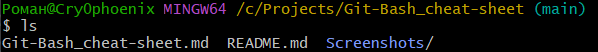
- mkdir - создаёт папку. Команде нужно передать имя новой папки.
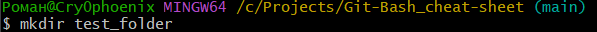
где "test_folder" это название папки, которую вам необходимо создать.
- touch - создаёт файлы. Команде нужно передать имя файла и расширение.
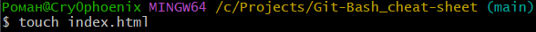
Если необходимо создать несколько файлов то их можно перечислить через пробел.

где "index.html" это название файла, который вам необходимо создать.
- rm - позволяет удалять файлы. Команде нужно передать имя файла и расширение.
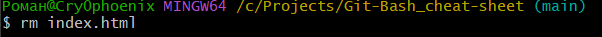
где "index.html" это название файла, который вам необходимо удалить.
- rmdir - позволяет удалять папки. Команде нужно передать имя удаляемой папки.
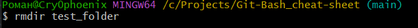
где "test_folder" это название папки, которую вам необходимо удалить.
Но если в папке, которую вы пытаетесь удалить, есть какие-то файлы, командная строка не удалит её и выведет сообщение, что папка не пуста:
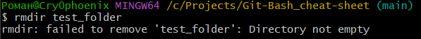
Это — защита от случайного удаления нужных файлов. Если папку всё-таки нужно удалить, можно использовать команду rm с ключом -r. Этот ключ отвечает за рекурсивное удаление файлов и папок. Это значит, что процесс удаления будет применён для всего содержимого директории.Будьте аккуратны, удаление файлов командами rm и rmdir необратимо — они идут мимо корзины и удаляются навсегда.
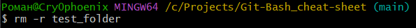
```
rm -r test_folder
```

---

## Репозиторий

- init - чтобы «Гит» начал работать в проекте, папку с ним нужно сделать git-репозиторием. Это значит, что «Гит» начнёт отслеживать все изменения внутри этой директории. Для этого переместитесь в папку с проектом и введите команду:
```
git init
```
- status - команда для получения общего представления о текущем состоянии репозитория. Она показывает изменённые файлы, которые ещё не зафиксированы, указывает файлы, подготовленные к коммиту, отображает новые файлы, которые не отслеживаются Git, предупреждает о конфликтах слияния или других проблемах.
```
git status
```
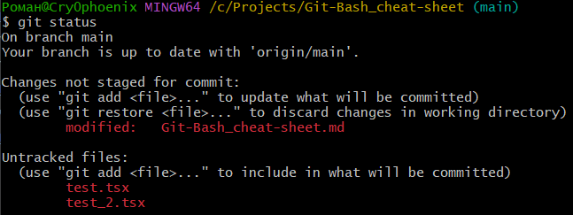
- add - команда отвечает за подготовку файлов к сохранению. ”Untracked files“ — неотслеживаемые файлы. Это значит, что «Гит» их видит, но, если попытаться сохранить их версию сейчас, «Гит» этого не сделает. При использовании команды add нужно указать имя файла, судьбу которого мы хотим зафиксировать в текущем виде.
```
git add test.tsx
```
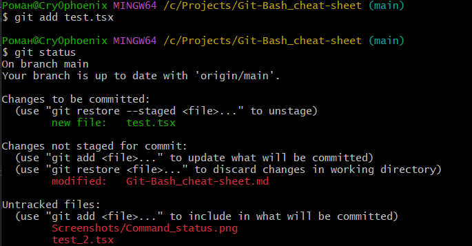
Если необходимо сохранить состояние всех файлов, можно передать команду add с флагом -A:
```
git add -A
```
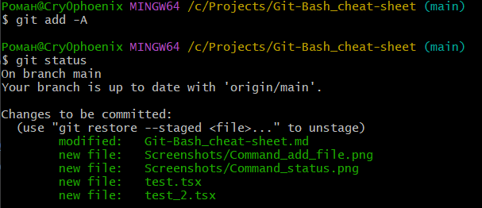
- commit - служит для фиксации изменений, то есть создания коммита из подготовленных к сохранению файлов. Команда используется с флагом -m для указания сообщения коммита прямо в командной строке.
```
git commit -m "test_commit"
```