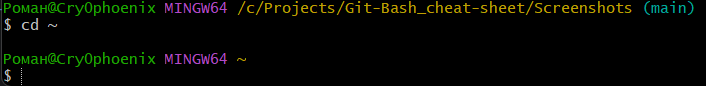
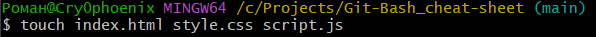

<h1 align="center">Памятка Git Bash</h1>

___

## Оглавление

1. [Навигация](#Навигация)
2. [Работа с файлами](#Работа с файлами)

___

## Навигация

- pwd - данная команда позволяет узнать в какой директории в текущий момент вы находитесь.

- cd - данная команда позволяет перемещаться из одной папки в другую.

где "Screenshots" это название папки, в которую вам нужно переместиться. Для того, чтобы переместиться на уровень выше вместо названия папки нужно написать две точки:
```
cd ..
```
При написании команды cd можно прописать сразу полный путь до необходимой директории:

Так же команду cd можно использовать с символом тильда "~", для возвращения в домашнюю директорию.

Чтобы не вводить названия файлов и папок полностью, можно начать вводить их имя и нажать клавишу Tab. Командная строка допишет путь сама, если соответствующий файл или папка есть в текущей директории.


## Работа с файлами

- ls - показывает файлы в папке, в который вы сейчас находитесь.

- mkdir - создаёт папку. Команде нужно передать имя новой папки.

где "test_folder" это название папки, которую вам необходимо создать.
- touch - создаёт файлы. Команде нужно передать имя файла и расширение.

Если необходимо создать несколько файлов то их можно перечислить через пробел.

где "index.html" это название файла, который вам необходимо создать.
- rm - позволяет удалять файлы. Команде нужно передать имя файла и расширение.

где "index.html" это название файла, который вам необходимо удалить.
- rmdir - позволяет удалять папки. Команде нужно передать имя удаляемой папки.

где "test_folder" это название папки, которую вам необходимо удалить.
Но если в папке, которую вы пытаетесь удалить, есть какие-то файлы, командная строка не удалит её и выведет сообщение, что папка не пуста:

Это — защита от случайного удаления нужных файлов. Если папку всё-таки нужно удалить, можно использовать команду rm с ключом -r. Этот ключ отвечает за рекурсивное удаление файлов и папок. Это значит, что процесс удаления будет применён для всего содержимого директории.Будьте аккуратны, удаление файлов командами rm и rmdir необратимо — они идут мимо корзины и удаляются навсегда.

```
rm -r test_folder
```
